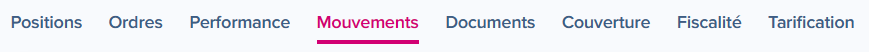
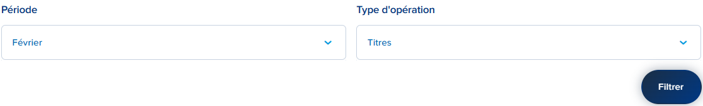

# Boursorama transactions export guide

## Preamble: TOB and TTF

TOB and TTF are two different cumulative taxes. Even if they come from a joint willingness of ten European countries to introduce a stock market-related tax, they have different effects:
- **TTF** is a tax which applies when you buy shares of certain French companies and do not trade them intraday. It applies to anybody who buys these shares, irrespective of the marketplace where they bought them and of the fiscal residence of the buyer.
- **TOB** is a territorial tax: it applies to the Belgian-resident principal who is buying securities, irrespective of where the securities are acquired.

So if you are a Belgian tax resident and buy shares of French companies with a market capitalisation larger than 1 billion euros, as a *bonus pater familia* (i.e. not for intraday trading), you will have to pay both the TTF (automated with Boursorama) and the TOB (not automated with Boursorama).

## How to export transactions for tobcalc on Boursorama

1. Login to your Boursorama interface
2. From your account list, under `Mes placements financiers`, click on the CTO (Compte Titre Ordinaire) for which you want to export transactions

3. On the CTO account menu, select `Mouvements`

4. In the `Filters` section, in `Période` select the month you want to export and in `Type d'opération` select `Titres`

5. Click on the `Exporter au format CSV` button below the resulting transaction list

6. The downloaded file(s) is to be used as input to `tobcalc` with the `Boursorama` broker selection

**Note: if you declare TOB on a bi-monthly basis, don't forget to export two files for the two months you want to declare**