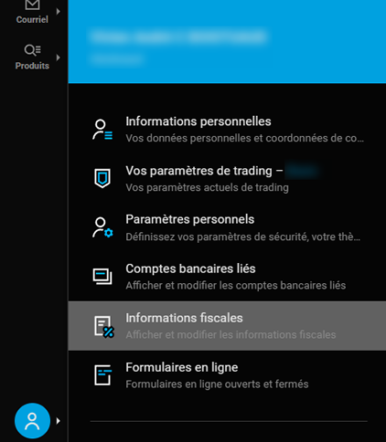
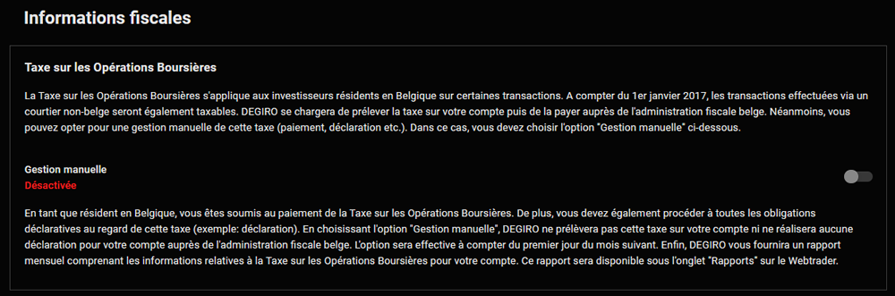
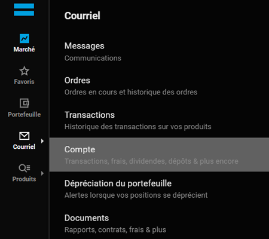
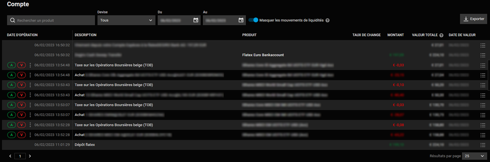
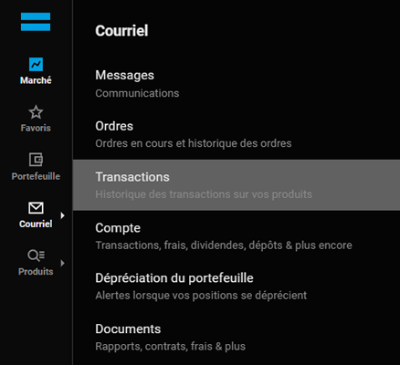
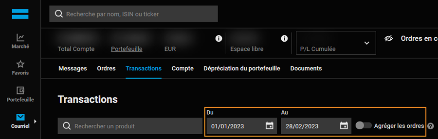
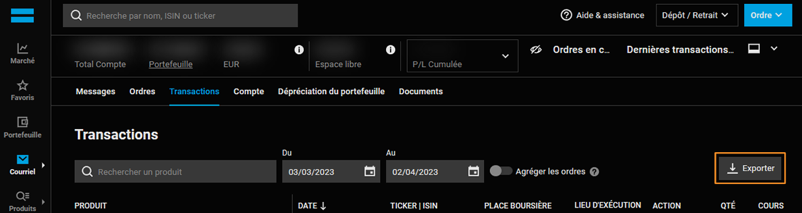
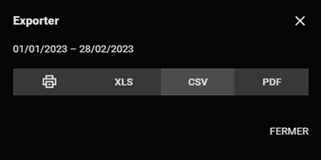

# DEGIRO transactions export guide

**Note: screenshots are from [degiro.fr](https://degiro.fr) in French. The language cannot be changed for Belgian accounts on [degiro.fr](https://degiro.fr), but the dashboard navigation should remain the same.**

## Preamble: TOB handling with DEGIRO

If you opened your account on:
- [degiro.nl](https://www.degiro.nl) or [degiro.fr](https://www.degiro.fr), the TOB may already be handled automatically by DEGIRO. In this case, you don't have to use tobcalc.
- any other DEGIRO website, the TOB is most likely not done automatically.

### How do I know if DEGIRO is already declaring TOB for me?

#### Verify if TOB declaration is enabled

1. On the left bar, click on the `My account` logo and then `Fiscal information`.

2. Check the status of `Manual management` switch for the TOB. If it is `Disabled`, DEGIRO is already declaring TOB for you.

**Note: if you change this switch, it only applies starting from the 1st of the next month as TOB is declared on a monthly or bimonthly basis.**

#### Verify if TOB was paid on your transactions

1. On the left bar, click on `Mail` and then `Account`

2. In your account statement, you should have one line for TOB for each transaction executed. The `Belgian TOB` line should be above the corresponding transaction.

The `amount` column on the `Belgian TOB` lines contains the amount of the TOB paid on the transaction.

## How to export transactions for tobcalc

1. Login to your DEGIRO dashboard
2. On the left bar, click on `Mail` and then `Transactions`

3. In the `Transactions` screen, select the start date of the TOB period and the end date of the TOB period. Make sure the `aggregate orders` function is **disabled** as TOB declarations requires indicating the exact number of transactions done on the period.

4. Click on the `export` button

5. Select `CSV` as export format on the export window

