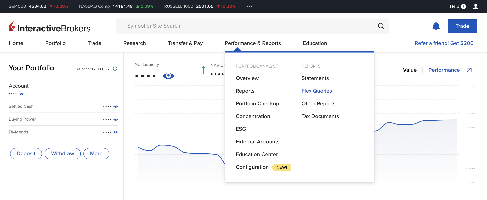
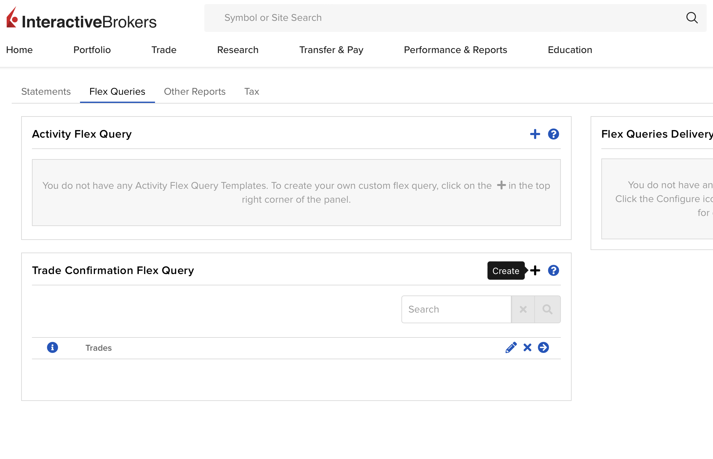
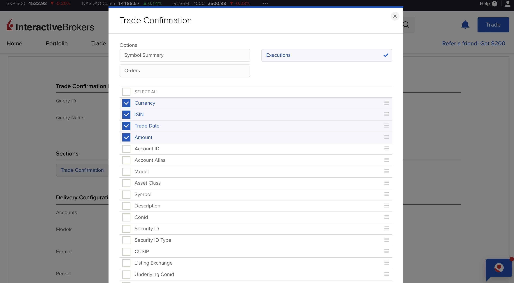
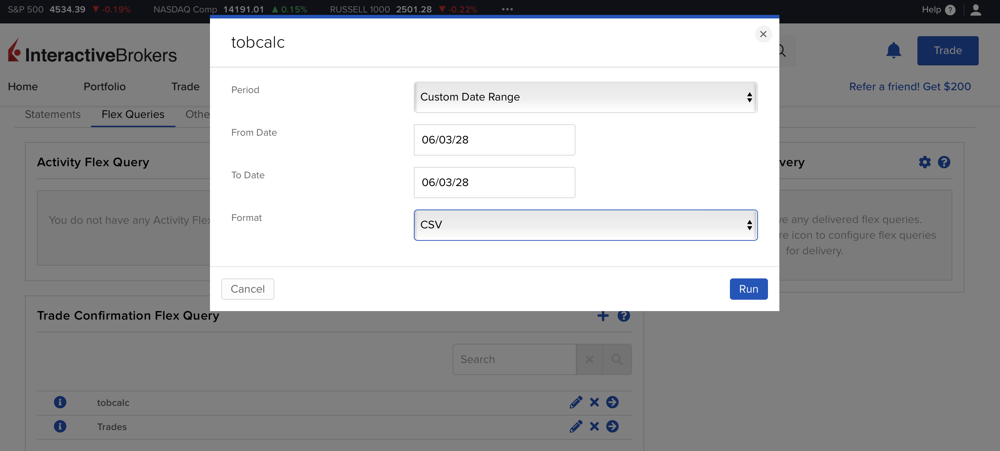

# Interactive Brokers transactions export guide

1. Login to your Interactive Brokers dashboard
2. Click on the "Performance & Reports" tab and then click on "Flex Queries"

3. Click on the "+" sign in the "Trade Confirmation Flex Query" section

4. Enter **tobcalc** into the "Query Name" input field and leave the other fields unchanged.
5. Click on "Trade Confirmation" under the "Sections" section
6. Check the following boxes:
- Currency
- ISIN
- Trade Date
- Amount

7. Scroll to the bottom of the page and save the query by clicking on "Continue"

## Using the flex query

A query named "tobcalc" should now be visible when you go to the flex queries page in your dashboard. To use it, click on the run button and then enter the dates you want to calculate the transaction tax between. **Make sure you change format to CSV as XML is not supported by tobcalc.** Now click on the "Run" button and your browser should download a `.csv` file. This file can be imported to tobcalc.

