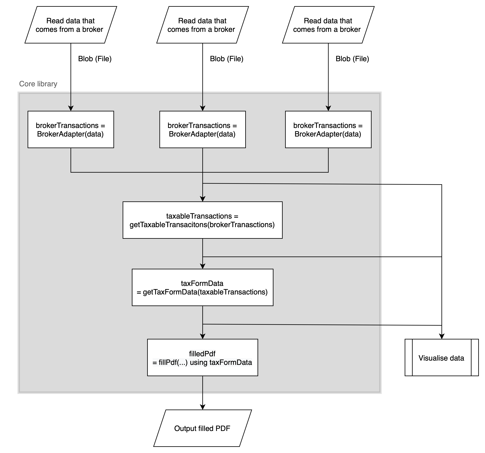

# Technical decisions and architecture

## Client-side processing

As this project will be handling sensitive financial data, the majority of the code needs to be run client-side so risks of data leaks are minimised and users can see exactly what is happening with their data. Server-side processing would be too risky and not transparent enough for this type of data. The web seems like the best platform for this type of application: it supports virtually all devices that can run a browser, it has modern APIs that allow for PDF processing and makes it fairly easy for developers to contribute towards this project.

## Limitations of a web app

Most third-party services or APIs have [Cross-Origin Resource Sharing headers](https://developer.mozilla.org/en-US/docs/Web/HTTP/CORS) that prevent websites other than their own from using them. This makes it impossible for tobcalc to contact the APIs needed to fetch exchange rates and basic data for securities, such as the name or type of security. This information is required to determine the correct tax rate for the transaction and is not always included in a broker's transactions export. 

To get around this, tobcalc uses Netlify, the host of [tobcalc.com](tobcalc.com), as a proxy. This means requests from the client get forwarded by the host to the API. The downside of this workaround is that some data passes through an extra server instead of being sent straight to the API. This data only includes the dates of transactions being sent to the European Central Bank's API for exchange rates and transaction's ISIN numbers being searched on Investing.com to determine the type of security.

The user can also self-host the site and proxy by building cloning the repository, building the code and running one of the include proxies with [Caddy](../proxy/Caddyfile) or Deno [../proxy/deno_proxy.ts].

## Possible attack vectors and mitigation techniques

The following has been done to reduce possible security exploits and attacks:

- [Subresource Integrity (SRI)](../site/public/index.html#L15) for third-party analytics script, verifying that the analytics script has not been changed and thus potentially compromised [(MDN)](https://developer.mozilla.org/en-US/docs/Web/Security/Subresource_Integrity)
- [Content Security Policy (CSP)](../site/public/_headers#L5) to stop XSS or potentially injected inline scripts from being run and to only allow scripts from the same origin [(MDN)](https://developer.mozilla.org/en-US/docs/Web/HTTP/CSP)
- [`X-Frame-Options: SAMEORIGIN`](../site/public_headers#L2) to prevent the page from rendering pages from different origins embedded into the user's page, stopping potential click-jacking [(MDN)](https://developer.mozilla.org/en-US/docs/Web/HTTP/Headers/X-Frame-Options)

## Deno

The core of this project has been written for Deno with TypeScript. The reason why Deno was chosen instead of Node.js or a different combination of runtime and language is mainly due to the fact that Deno is very web compatible. This is because Deno implements many of the same APIs that are also implemented in browsers, resulting in a codebase that is cross-compatible between the two platforms. Serverless platforms such as Cloudflare Workers are also fairly web compatible which is useful if server-side processing would be required in the future. Another benefit of being web compatible is that existing documentation can be used from platforms such as the Mozilla Developer Network. The main alternative, Node.js, would require more third party dependencies to polyfill web APIs that are not natively available. 

Besides web compatibility, Deno has also offered other benefits to the overall developer experience. For example, first class TypeScript support and a built-in, albeit basic bundler have made it possible to [export an ES module with just one command](../build/web_bundle.sh). It also includes a built-in test runner which can easily be integrated and automated in GitHub actions. 

What Deno has not been good at is supporting the IDE I use, namely WebStorm. The official plugin from JetBrains is quite buggy. Sometimes third-party dependencies aren't cached properly and even when they are, WebStorm seems to struggle to show parameter hints for some functions.

## Svelte for the web app

At first, it didn't seem like a bad idea to develop the web app without a framework. The main thing it has to do is handle the data from the main input fields and transaction files from brokers, pass that data to the functions in the core library and then display the output. However, it quickly became apparent how much boilerplate code input handling requires. To fix this issue and to improve the developer experience, Svelte is now used for the web app. The Svelte compiler handles state management and now generates that boilerplate code instead of us having to write it manually. One of the main reasons why Svelte was chosen instead of other frameworks was the bundle size: at the time of writing, the Svelte bundle for tobcalc.com is 20.4 kB while the size of the React-DOM library alone is 121.1 kB. The main downside is that it's a fairly new framework that most developers won't be familiar with, possibly making it more difficult to contribute to this web app side of this project. 

## How the web app and Deno code works together

The core library that has all the functions needed for PDF generation, tax calculations and brokers transaction processing is in the `src` directory. Other scripts that are not part of the core library but are needed to _generate_ parts of the library are in the `scripts` directory. This includes the [script](../scripts/fetch_registered_funds.ts) that fetches the latest list of funds from the FSMA. The [`web_export.ts`](../web_export.ts) file re-exports all the functions in the core library that are needed by the web app and the [`web_worker_pdf.ts`](../web_worker_pdf.ts) implements the PDF processing functions as a Web Worker for the web app, so the PDF processing can be run in a background thread without slowing down the web interface. [`web_bundle.sh`](../web_bundle.sh) uses to the Deno bundler to output both these files as two ES-modules, `tobcalc-lib.js` and `tobcalc-lib-pdf.js`, that are imported natively in the web app. 

The web app acts as the glue that makes all the functions of the core library work as one piece. This flowchart visualises what exactly happens.

## Tests

Most files in the core library contain functions or sets of functions that can be tested in isolation. Files in the `src` directory ending with `_test.ts` are unit tests that can be [run with Deno](../.github/workflows/deno-tests.yml#L12). These tests are crucial as they contain edge-cases for things like number formatting as well checks to see if the generated PDF has filled in the right input fields. Failed tests could mean that the generated PDF contains inaccurate tax information. The web app contains some very [basic tests](../site/src/tests.ts) which are run get every time a client visits the web app. These tests check whether the proxy is functioning and whether the fetched data is accurate.  
