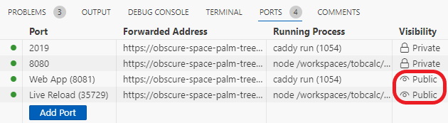

# Developing tobcalc using Github Codespaces

To simplify development, a `devcontainer.json` file is configured, which allows to easily setup a [Github Codespace](https://github.com/features/codespaces).

## First Launch

Creation of the codespace takes about 3 minutes and takes care of installing all necessary dependencies to run and develop `tobcalc`.
Once everything is setup, you only have to make sure that the forwarded ports `8081` (for the Web App) and `35729` (for Live Reload) have public visibility. To configure this, go to the "PORTS" tab at the bottom of your screen and right click on the port to change its visibility (see image below). Usually, this should only be done once and the codespace will remember this setting on subsequent launches.

## Development

Make sure to read the [local development instructions](local-development.md). The codespace is configured to run most of the necessary commands on every launch, so you can just start coding. The only manual intervention that is still needed is to update `web_export.ts` to reflect any changes you made and run `./web_bundle.sh` (step 2 and 3 in the local development instructions). Running this script can be done from the "TERMINAL" tab. In this tab, you might also see the two running processes referred to in the local development instructions (one to run `caddy` and one to run `npm`). You can just leave these running in the background or check the output to resolve any errors.
Finally, to preview the Web App, you can go to the "PORTS" tab and click on the forwarded address for port `8081` (with label Web App).
